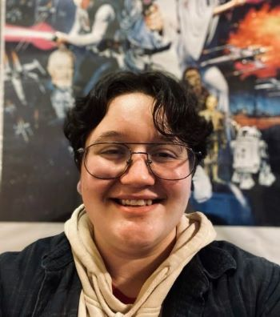
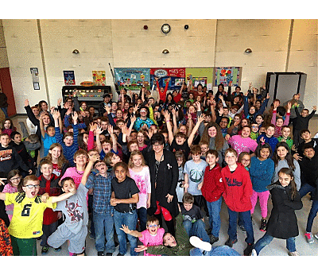
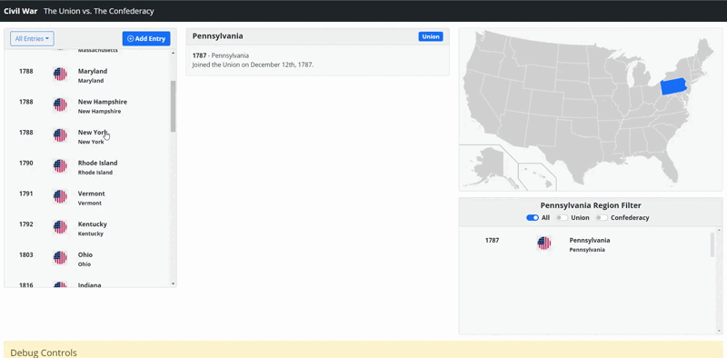
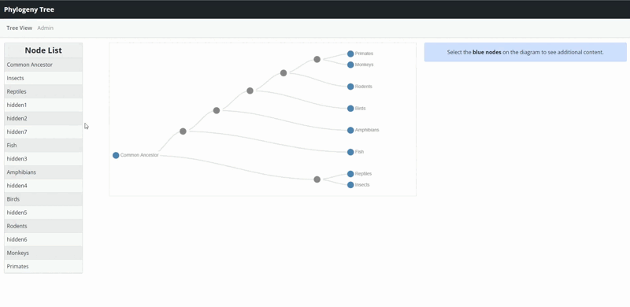
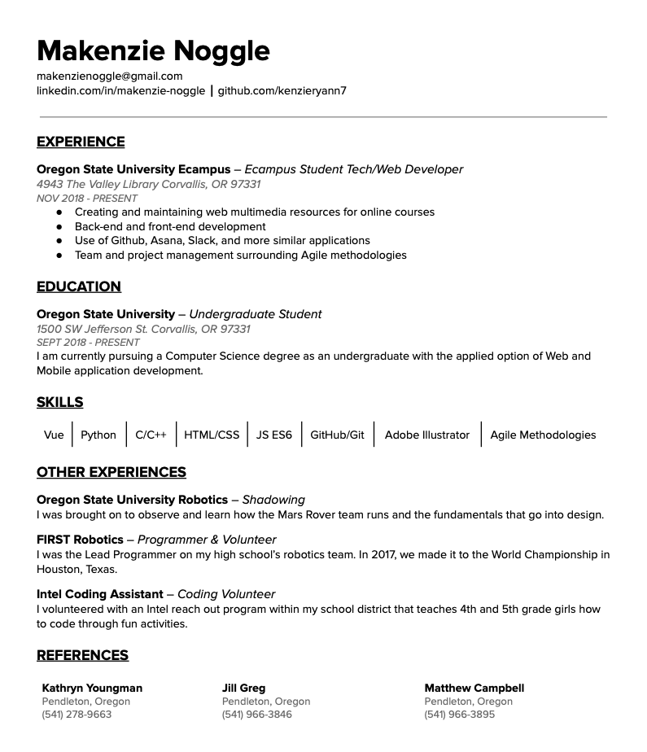

# Introduction

**Aspiration**

I aspire to use code to help aid learning and further science.

I am currently pursuing a bachelor's degree in Computer Science at
Oregon State Univeristy. **GO BEAVS!** I
started my journey here at OSU in 2018 and jumped right into web
development. I taught myself how to create simple websites using HTML and JS with a touch of CSS. I currently work with OSU Ecampus as a Student Web Developer on their Custom Team. This opportunity has allowed me to hone my development skills.

Throughout this experience, I have been able to grasp the fundamental concepts of AGILE methodology, use a framework such as Vue.js, and develop traditional practices when creating and designing a website. Also, I have
some experience with SQL and database design.

I first became introduced into coding in high school when I joined FIRST Robotics (For Inspiration and Recognition of Science and Technology). I was the lead programmer who was mostly self-taught. I realized all that you can do with code and it really intrigued me. My involvement in robotics has opened up endless opportunities. It has helped me find my passion in technology.

On my free time, I like to develop simple games that are easily played through the
browser. As they say, practice, practice, practice. Diving into different type of games has allowed me to be open minded about how to solve a problem. I've realized that there are various ways to solve just one problem and I think this is why I have enjoyed being a developer. The never-ending possibilities excite me. I love to learn and get more experience where I can. Aside from coding, I enjoy the outdoors such as hiking, fishing, and camping. I also am into writing and gaming.

## Experience

### Work

I was offered a job at Oregon State Univeristy's Ecampus program. I am still employed there as of today going on my third year being a web developer. My tasks as a web developer consists of following AGILE software development methodology for team projects, developing educational interactives with the Vue framework, maintaining the front-end and back-end of a web application, and designing illustrations as SVGs in Adobe Illustrator.
 
 
I have worked closesly with Bootstrap 5 as our main source of CSS design for quick and easy development. Within my position at OSU Ecampus, I have learned how team and project management works and what it might look like in a variety of different settings. I am familiar with Github and other similar applications. I currently maintain and create web multimedia resources for online courses at OSU.

### Outreach

#### Intel Coding Assistant

I volunteered with an Intel reachout program within my school district that teaches 4th and 5th grade girls how to code through fun activities using a site called **[Scratch](https://scratch.mit.edu/about)**. Scratch is a block-based visual programming language made to help children understand the fundamentals of coding. I believe that this experience helped me better understand the basics of coding because teaching code brings a different perspective of learning.

#### Robotics Mentor/Volunteer

My involvement with FIRST Robotics has also brought an abundance of volunteering opportunities. I worked alongside with our elementary and middle school robotics teams as a code mentor. I helped them in the development process of basic coding and help them indentify issues by debugging. I also was a volunteer for their competitions that were affiliated with FIRST, helping all competing teams with code debugging and any questions they may of have.

## Work Project Samples

### Atlas

Atlas is a timeline map interactive where a user can submit an event, giving a description and media if any. Once submitted, it will populate in the list sidebar and when selected it will highlight that particular region on the map.
 

### Phylogenetic Tree

This interactive allows the user to edit/insert new nodes into the phylogenetic tree. Where the tree shows the evolutionary relationships between biological species and organisms based on physical and genetic characteristics. This application takes advantage of the **[D3.js](https://d3js.org/)** Javascript Library.
 

### Glossary

Glossary is a simple interactive where the user may enter terms and definitions. An admin, such as an instructor, can approve, edit, or remove entries. These entries may be exported via Google Sheets if the admin would like to save all entries.
 

## Personal Projects

### Pokédex Database

This application was created with Vue and Bootstrap 5. I originally created this Pokédex Database of Generation 1 Pokémon as an assignment for a class. I added more content such as being able to view more info about the selected Pokémon. The user has the ability to filter by name or Pokédex number in either ascending or descending order. Also, they can use the search bar to quickly look up a Pokémon.
 
**[Github Repo](https://github.com/kenzieryann7/vue-pokedex)**

<h3>*MORE COMING SOON*</h3>

## Résumé

## Contact Me

**Phone**
 
(541) 936-6439
 
**Email**
 
makenzienoggle@gmail.com
