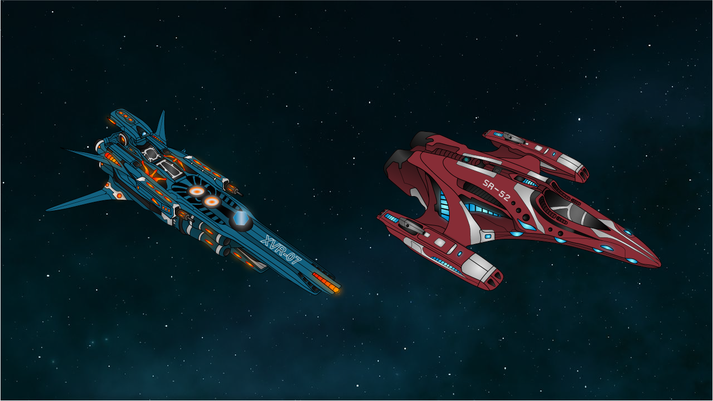

# Introduction

I earned a Bachelor's degree in Computer Science from Oregon State University in 2023, starting my journey in 2018 with a focus on web development. My passion lies in coding and creating interactive web applications. I have hands-on experience with HTML, CSS, JavaScript, Vue.js, and other technologies. Even with five years of experience, I am continually seeking opportunities to expand my skill set and embrace new technologies.

My introduction to coding began in high school through my involvement in FIRST Robotics (For Inspiration and Recognition of Science and Technology), where I served as the lead programmer. This role, which was largely self-taught, sparked my fascination with the endless possibilities that coding offers. Robotics opened many doors for me and solidified my passion for technology.

In my free time, I enjoy developing simple browser games, which has taught me to approach problem-solving with an open mind. The diversity of game types has shown me that there's always more than one way to tackle a problem, which is a big part of why I love being a developer. Beyond coding, I have a deep appreciation for the outdoors, writing, and gaming.

# Work Experience

## Oregon State University Ecampus

### Student Web Developer

Upon starting college, I sought out opportunities to gain web development experience and secured a position as a Student Web Developer at Oregon State University Ecampus. Throughout my academic career, I immersed myself in the dynamics of a web team. My responsibilities included following the AGILE software development methodology for team projects, developing educational interactives using the Vue framework and Bootstrap, managing version control with Git and GitHub, and designing illustrations as SVGs in Adobe Illustrator.

### Analyst Programmer

After graduating, I transitioned into a contracted role as a Program Analyst at Oregon State University Ecampus. Leveraging my experience as a student developer, I took on greater responsibilities and contributed to over 50 projects over five years. My role expanded to include conducting requirement gathering, attending project meetings with instructors and instructional designers to ensure project scope alignment, creating and maintaining project documentation, and providing support for the web team.

## UniCreatives - Web Developer

I am currently a Web Developer at UniCreatives, LLC, a startup focused on providing a platform for emerging talent, including students and alumni, to find work opportunities. In this role, I am responsible for developing and maintaining the company website, creating and updating content, and collaborating with the team to ensure we meet project milestones. We are gearing up to launch for our first round of beta testers.

# Work Projects

## Atlas

Atlas is a timeline map interactive where a user can submit an event, giving a description and media if any. Once submitted, it will populate in the list sidebar and when selected it will highlight that particular region on the map.

 

## Phylogenetic Tree

This interactive allows the user to edit/insert new nodes into the phylogenetic tree. Where the tree shows the evolutionary relationships between biological species and organisms based on physical and genetic characteristics. This application takes advantage of the **[D3.js](https://d3js.org/)** Javascript Library.

 

## Glossary

Glossary is a simple interactive where the user may enter terms and definitions. An admin, such as an instructor, can approve, edit, or remove entries. These entries may be exported via Google Sheets if the admin would like to save all entries.

 

# Personal Projects

## Pokédex Database

This application was created with Vue and Bootstrap 5. I originally created this Pokédex Database of Generation 1 Pokémon as an assignment for a class. I added more content such as being able to view more info about the selected Pokémon. The user has the ability to filter by name or Pokédex number in either ascending or descending order. Also, they can use the search bar to quickly look up a Pokémon.

<a href="https://github.com/kenzieryann7/vue-pokedex" target="_blank" class="button" style="margin-bottom: 1rem">GitHub Repo</a>

## Asset Creation

I have a small collection of assets that I have created for various projects. These assets include spaceships, characters, and other miscellaneous items. I have created these assets using Adobe Illustrator. I have also created a few animations using Adobe After Effects.

 

# Outreach

## Intel Coding Assistant

I volunteered with an Intel reachout program within my school district that teaches 4th and 5th grade girls how to code through fun activities using a site called **[Scratch](https://scratch.mit.edu/about)**. Scratch is a block-based visual programming language made to help children understand the fundamentals of coding. I believe that this experience helped me better understand the basics of coding because teaching code brings a different perspective of learning.

## Robotics Mentor/Volunteer

My involvement with FIRST Robotics has also brought an abundance of volunteering opportunities. I worked alongside with our elementary and middle school robotics teams as a code mentor. I helped them in the development process of basic coding and help them indentify issues by debugging. I also was a volunteer for their competitions that were affiliated with FIRST, helping all competing teams with code debugging and any questions they may of have.

# Resume

<a href="media/documents/resume-2024.pdf" download class="button">Download Resume</a>

# Contact Me

**Email**
 
makenzienoggle@gmail.com
