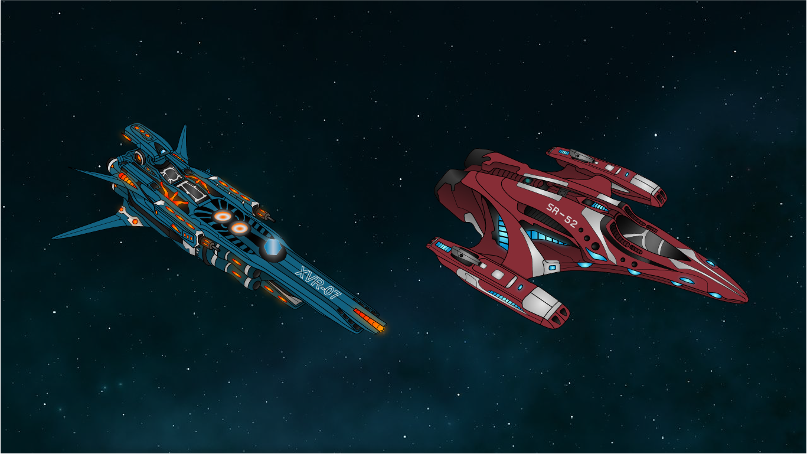

## Pokédex Database

This application was created with Vue and Bootstrap 5. I originally created this Pokédex Database of Generation 1 Pokémon as an assignment for a class. I added more content such as being able to view more info about the selected Pokémon. The user has the ability to filter by name or Pokédex number in either ascending or descending order. Also, they can use the search bar to quickly look up a Pokémon.

<a href="https://github.com/kenzieryann7/vue-pokedex" target="_blank" class="button" style="margin-bottom: 1rem">GitHub Repo</a>

## Asset Creation

I have a small collection of assets that I have created for various projects. These assets include spaceships, characters, and other miscellaneous items. I have created these assets using Adobe Illustrator. I have also created a few animations using Adobe After Effects.

 

