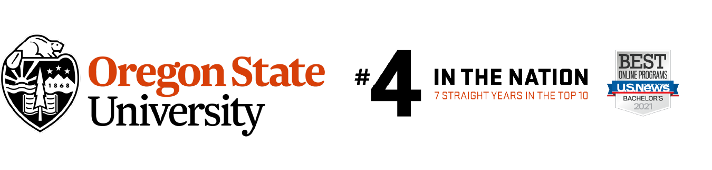

## Oregon State University Ecampus

### Student Web Developer

Upon starting college, I sought out opportunities to gain web development experience and secured a position as a Student Web Developer at Oregon State University Ecampus. Throughout my academic career, I immersed myself in the dynamics of a web team. My responsibilities included following the AGILE software development methodology for team projects, developing educational interactives using the Vue framework and Bootstrap, managing version control with Git and GitHub, and designing illustrations as SVGs in Adobe Illustrator.

### Analyst Programmer

After graduating, I transitioned into a contracted role as a Program Analyst at Oregon State University Ecampus. Leveraging my experience as a student developer, I took on greater responsibilities and contributed to over 50 projects over five years. My role expanded to include conducting requirement gathering, attending project meetings with instructors and instructional designers to ensure project scope alignment, creating and maintaining project documentation, and providing support for the web team.

## UniCreatives - Web Developer

I am currently a Web Developer at UniCreatives, LLC, a startup focused on providing a platform for emerging talent, including students and alumni, to find work opportunities. In this role, I am responsible for developing and maintaining the company website, creating and updating content, and collaborating with the team to ensure we meet project milestones. We are gearing up to launch for our first round of beta testers.