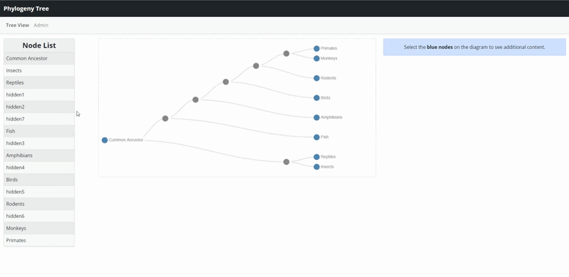

## Atlas

Atlas is a timeline map interactive where a user can submit an event, giving a description and media if any. Once submitted, it will populate in the list sidebar and when selected it will highlight that particular region on the map.

 

## Phylogenetic Tree

This interactive allows the user to edit/insert new nodes into the phylogenetic tree. Where the tree shows the evolutionary relationships between biological species and organisms based on physical and genetic characteristics. This application takes advantage of the **[D3.js](https://d3js.org/)** Javascript Library.

 

## Glossary

Glossary is a simple interactive where the user may enter terms and definitions. An admin, such as an instructor, can approve, edit, or remove entries. These entries may be exported via Google Sheets if the admin would like to save all entries.

 

